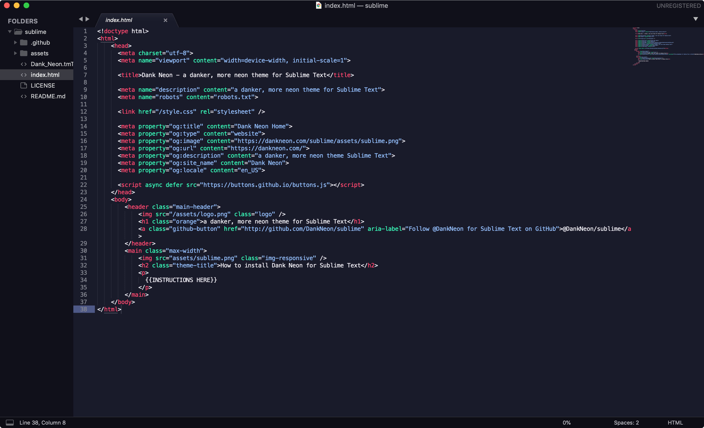

# Dank Neon for [Sublime Text](http://sublimetext.com)

> A danker, more neon theme for [Sublime Text](http://sublimetext.com).

## Install

### Install using Package Control
If you are using [Package Control](http://wbond.net/sublime_packages/package_control), you can easily install Dank Neon via the `Package Control: Install Package` menu item. The Dank Neon package is listed as `Dank Neon` in the packages list.

## Team

This theme is maintained by the following people

|  |  |
| ------------------------------------------------------------------------------------------------------------------- | ----------------------------------------------------------------------------------------------------- |
| [Jacobi Petrucciani](https://github.com/jpetrucciani)                                                               | [Conlin Durbin](https://github.com/wuz)                                                               |

## License

[MIT License](./LICENSE)
